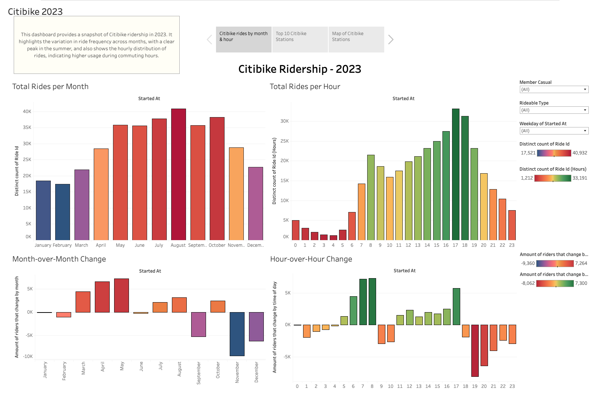

# [Citibike Ridership Analysis - 2023](https://public.tableau.com/app/profile/andrew.vick/viz/module_18_17247479263400/Citibike#1)

This Tableau story provides a comprehensive overview of Citibike usage patterns in 2023, leveraging visualizations and interactive filters to uncover key insights.

## Key Findings:

- **Seasonal Trends:** Ridership peaks in the summer months and declines in the winter, suggesting a strong influence of weather.
- **Commuting Patterns:** Hourly data reveals distinct morning and evening peaks, indicating significant use for commuting.
- **Station Popularity:** The top 10 stations by ride count and average ride duration are identified, showcasing varying usage patterns across locations.
- **Geographic Distribution:** A map view highlights the distribution of stations and average ride duration, revealing areas of high demand and differing usage behaviors.

## Interactive Features:

- Filter by rider type (member/casual), bike type, and day of the week to gain deeper insights into specific user segments and usage patterns.
- Hover over map points to view detailed station information.

## Potential Use Cases:

- Optimize bike availability and station placement based on demand and usage patterns.
- Tailor marketing and pricing strategies to different user segments and locations.
- Inform urban planning and transportation initiatives.

## Explore the Story:

Navigate through the Tableau story to discover detailed visualizations and interactive elements. Gain a deeper understanding of Citibike ridership and its implications for urban mobility.
